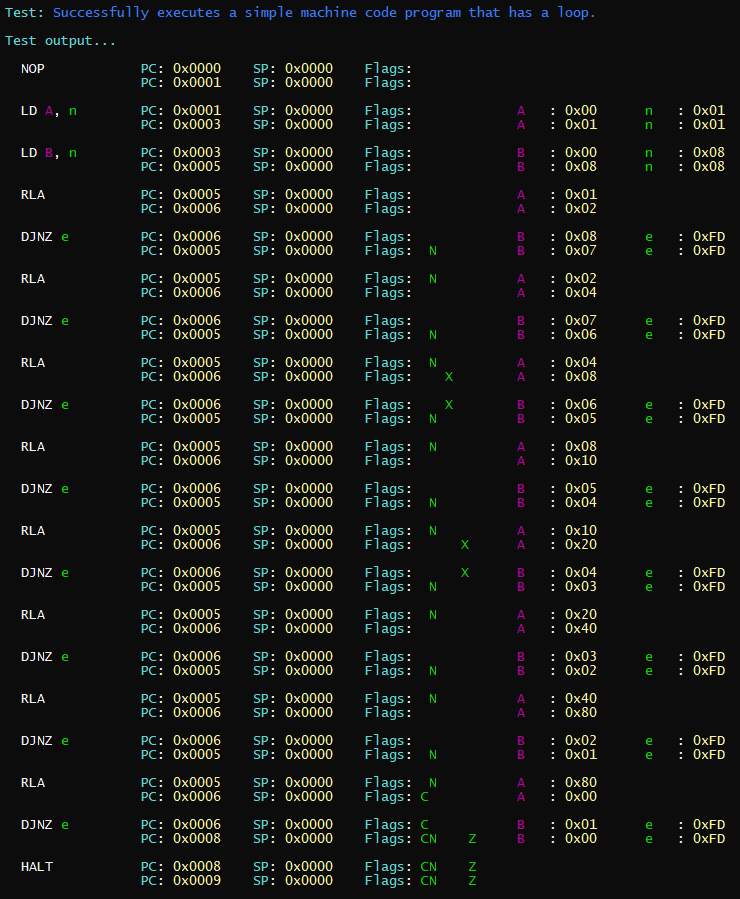

# ZXE

A ZX Spectrum emulator. Mostly about just seeing if I can.

128/48 BASIC both seem to work.

A bunch of games also, see https://www.outsidecontextproblem.com/zxe-more-progress.html.

## Current tested games list

Some games require 128 emulation, some 48. Will update list to indicate this when I can.

- Barbarian 2
- Batman: The Movie
- Cybernoid
- Cybernoid 2
- Dan Dare 3
- Dizzy
- Exolon
- Fantasy World Dizzy
- Great Escape, The
- Head Over Heels
- Indiana Jones and the Temple of Doom 
- Jet Pac
- Manic Miner
- Myth: History in the Making
- Robocop
- Robocop 2
- Teenage Mutant Hero Turtles
- Treasure Island Dizzy
- Wizard's Lair

## Features

So far, apart from a WIP emulator, I have...

### Colourised Tracing of Machine Code Execution

## Solution Structure

### ZXE.Windows.Host

This will run the Spectrum emulator on Windows. For now, you'll have to edit `Program.cs` to change the version (48/128) being emulated.

Press F10 to load a Z80 file.

### ZXE.Core

This is the emulator. I have tried to keep all the Z80 specific code in the Z80 folder so it can be used in contexts other than only a ZX Spectrum emulator.

### ZXE.Core.Tests

Unit tests for the above.

### ZXE.Core.Tests.Console

Run some select tests in the console so the developer has easy access to the test output.

### ZXE.Core.ThirdPartyTests

Runs tests against this awesome suite:

- https://github.com/raddad772/jsmoo/tree/main/misc/tests/GeneratedTests/z80/v1

## ROMS

- https://github.com/archtaurus/RetroPieBIOS

## Sinclair Wiki

- https://sinclair.wiki.zxnet.co.uk/wiki/Main_Page

## Useful Resources

- https://clrhome.org/table/
- https://floooh.github.io/
- http://www.breakintoprogram.co.uk/hardware/computers/zx-spectrum/memory-map
- https://worldofspectrum.org/faq/reference/128kreference.htm
- https://github.com/floooh/chips-test/tree/master/tests/fuse
- https://dotneteer.github.io/zx-spectrum/2018/01/26/zxspectrum-part-4.html

## Games

- https://www.planetemu.net/roms/sinclair-zx-spectrum-z80

## Game pokes

- https://www.the-tipshop.co.uk/

